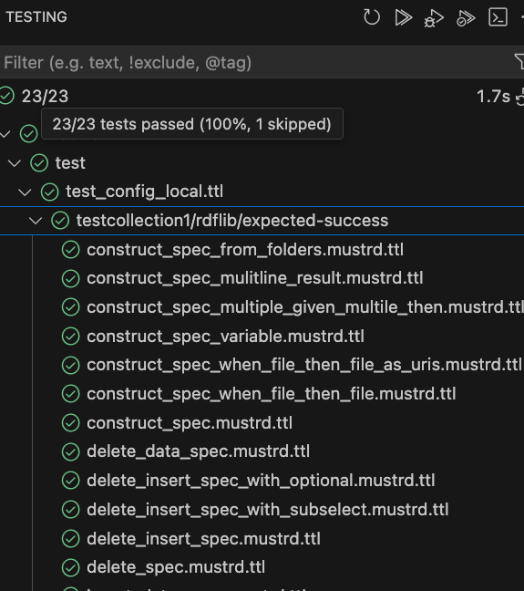

# MustRD

**"MustRD: Validate your SPARQL queries and transformations with precision and confidence, using BDD and Given-When-Then principles."**

[](https://github.com/Semantic-partners/mustrd/tree/python-coverage-comment-action-data)

## Why?

SPARQL is a powerful query language for RDF data, but how can you ensure your queries and transformations are doing what you intend? Whether you're working on a pipeline or a standalone query, certainty is key.

While RDF and SPARQL offer great flexibility, we noticed a gap in tooling to validate their behavior. We missed the robust testing frameworks available in imperative programming languages that help ensure your code works as expected.

With MustRD, you can:

- Define data scenarios and verify that queries produce the expected results.
- Test edge cases to ensure your queries remain reliable.
- Isolate small SPARQL enrichment or transformation steps and confirm you're only inserting what you intend.

## What?

MustRD is a Spec-By-Example ontology with a reference Python implementation, inspired by tools like Cucumber. It uses the Given-When-Then approach to define and validate SPARQL queries and transformations.

MustRD is designed to be triplestore/SPARQL engine agnostic, leveraging open standards to ensure compatibility across different platforms.

### What it is NOT

MustRD is not an alternative to SHACL. While SHACL validates data structures, MustRD focuses on validating data transformations and query results.

## How?

You define your specs in Turtle (`.ttl`) or TriG (`.trig`) files using the Given-When-Then approach:

- **Given**: Define the starting dataset.
- **When**: Specify the action (e.g., a SPARQL query).
- **Then**: Outline the expected results.

Depending on the type of SPARQL query (CONSTRUCT, SELECT, INSERT/DELETE), MustRD runs the query and compares the results against the expectations defined in the spec.

Expectations can also be defined as:

- INSERT queries.
- SELECT queries.
- Higher-order expectation languages, similar to those used in various platforms.

## Example

### Configuration File

You'll have a configuration `.ttl` file, which acts as a suite of tests. It tells MustRD where to look for test specifications and any triplestore configurations you might have:

```ttl
:test_example a :MustrdTest;
              :hasSpecPath "test/specs/";
              :hasDataPath "test/data/";
              :hasPytestPath "example";
              :triplestoreSpecPath "test/triplestore_config/triplestores.ttl";
              :filterOnTripleStore triplestore:example_test .
```

### Test Specification

In the directory specified by `:hasSpecPath`, you'll have one or more `.mustrd.ttl` files. These can be organized in a directory structure. MustRD collects them and reports results to your test runner.

```ttl
:test_example :given [ a :FileDataset ;
                       :file "test/data/given.ttl" ] ;
              :when [ a :TextSparqlSource ;
                     :queryText "SELECT ?s ?p ?o WHERE { ?s ?p ?o }" ;
                     :queryType :SelectSparql ] ;
              :then [ a :OrderedTableDataset ;
                     :hasRow [ :variable "s" ; :boundValue "example:subject" ;
                               :variable "p" ; :boundValue "example:predicate" ;
                               :variable "o" ; :boundValue "example:object" ] ].
```

And you will have a `'test/data/given.ttl'` which contains the given ttl. 

```ttl
example:subject example:predicate example:object .
```

### Running Tests

Run the test using the MustRD Pytest plugin:

```bash
poetry run pytest --mustrd --config=test/mustrd_configuration.ttl --md=render/github_job_summary.md
```

This will validate your SPARQL queries against the defined dataset and expected results, ensuring your transformations behave as intended.

You can refer to SPARQL inline, in files, or in Anzo Graphmarts, Steps, or Layers. See `GETSTARTED.adoc` for more details.

#### Integrating with Visual Studio Code (vscode)
We have a pytest plugin.
1. Choose a python interpreter (probably a venv)
2. `pip install mustrd ` in it.
3. add to your settings.json
```json
    "python.testing.pytestArgs": [
        "--mustrd", "--md=junit/github_job_summary.md", "--config=test/test_config_local.ttl"
    ],
```
4. VS Code should auto discover your tests and they'll show up in the flask icon 'tab'.


## Competency questions & ontology coverage

A test spec can record the competency question (CQ) it answers:

```ttl
:test_example a :TestSpec ;
    :CompetencyQuestion "In which country is Rotterdam?" ;
    :given ... ; :when ... ; :then ... .
```

With `--md`, the report includes a **CQ table** — one row per spec showing the
question and whether its test passed:

```bash
pytest --mustrd --config=path/to/config.ttl --md=report.md
```

### Ontology term coverage

Beyond "do my CQs pass?", MustRD can report **how much of your ontology those
CQs actually exercise**. This is opt-in via `--term-coverage`, which prints an
overall percentage and a per-term table to stdout (and appends it to the `--md`
file when one is given).

Tell MustRD which ontology to measure against with `:hasOntologyPath` in your
config — a file or a directory (scanned recursively), repeatable:

```ttl
:myTest a :MustrdTest ;
    :hasSpecPath     "specs/" ;
    :hasDataPath     "data/" ;
    :hasOntologyPath "ontology/" ;   # file or directory; repeat for several
    :filterOnTripleStore triplestore:RdfLib .
```

```bash
# coverage to stdout
pytest --mustrd --config=path/to/config.ttl --term-coverage

# coverage to stdout AND written to the report file
pytest --mustrd --config=path/to/config.ttl --term-coverage --md=report.md
```

(If `--term-coverage` is set without `:hasOntologyPath`, MustRD fails early and
tells you exactly what to add.)

A declared term counts as **used** when a *passing* CQ test exercises it — either
in its input data (as an instance type or asserted predicate) or in its SPARQL
query. Terms that are only structurally referenced (the `rdfs:domain`/`rdfs:range`
of a used property, or a superclass of a used class) are reported separately as
**schema** terms and excluded from the percentage, rather than flagged as gaps.
The result classifies every term as *fully exercised*, *data-only*, *query-only*,
*schema*, or *unused* — so untested terms surface immediately.

See [`docs/ontology-term-coverage.md`](docs/ontology-term-coverage.md) for the
full definition and [`docs/examples/term-coverage-example.md`](docs/examples/term-coverage-example.md)
for sample output.

## When?

MustRD is a work in progress, built to meet the needs of our projects across multiple clients and vendor stacks. While we find it useful, it may not meet your needs out of the box.

We invite you to try it, raise issues, or contribute via pull requests. If you need custom features, contact us for consultancy rates, and we may prioritize your request.

## Support

Semantic Partners is a specialist consultancy in Semantic Technology. If you need more support, contact us at info@semanticpartners.com or mustrd@semanticpartners.com.


